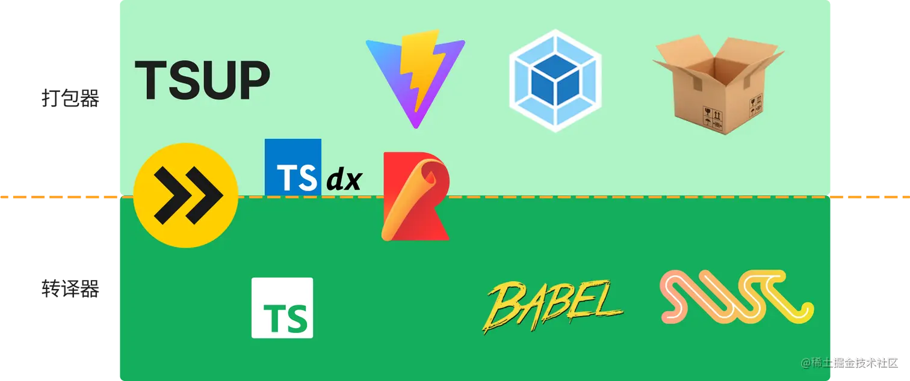

# 配置文件说明

## tsconfig.json

TypeScript 的配置文件，用于控制编译器的行为。

## package.json

Node.js 项目的配置文件，用于管理项目的依赖、构建脚本、运行脚本等。

## editorconfig

编辑器配置文件，用于控制代码格式化、编码风格等。

## mvmrc

MVM 项目的配置文件，用于控制 MVM 项目的构建、发布等。

## .prettyignore

MVM 项目的忽略文件，用于控制 MVM 项目的编译、发布时忽略的文件。

## .terserrc

Terser 压缩器的配置文件，用于控制 Terser 压缩器的行为。

## .yarnrc.yml

Yarn 包管理器的配置文件，用于控制 Yarn 包管理器的行为。

## crpress.json

Crpress 项目的配置文件，用于控制 Crpress 项目的构建、发布等。

### crpress

软件简介
Cypress 是为现代网络而构建的下一代前端测试工具，用于解决开发者和 QA 工程师在测试现代应用程序时面临的关键难题。
Cypress 简化了设置测试、编写测试、运行测试和调试测试，支持端到端测试、集成测试和单元测试，支持测试在浏览器中运行的任意内容。支持 Mac OS、Linux 和 Windows 平台。

```agsl
$ npx cypress open
It looks like this is your first time using Cypress: 8.7.0


Cypress failed to start.

This may be due to a missing library or dependency. https://on.cypress.io/required-dependencies

```

install cypress

```agsl
$ npm install cypress --save-dev
```

use cypress

```agsl
$ npx cypress open
```

## stitches.config.ts

https://juejin.cn/post/7085542534943883301

CSS-in-CSS 方案： CSS Modules
CSS-in-JS 方案： Styled Components （目前最受欢迎）

备选： Emotion 或 Stitches

函数式 CSS：Tailwind CSS
备选：CSS 类的条件渲染：clsx
https://stitches.dev/
Stitches 项目的配置文件，用于控制 Stitches 项目的构建、发布等。
Style your components with confidence
CSS-in-JS with near-zero runtime, SSR, multi-variant support, and a best-in-class developer experience.

## build.mjs

Esbuild 项目的配置文件，用于控制 Esbuild 项目的构建、发布等。
ESBuild 可以脱离 webpack 或其他打包工具，直接运行在 Node.js 环境中，
可以实现快速的构建和压缩，并且支持 JSX、TypeScript、CSS、JSON 等文件格式。
https://juejin.cn/post/7134925339502837774
https://esbuild.bootcss.com/
底层 JS/TS 转译器：纯粹用于将 TypeScript/JavaScript/JSX 编译到某种特定运行环境下的底层转译器，代表有 Babel、TSC、esbuild 和 SWC 等。虽然我将它们归类为转译器，但是它们大都也支持打包的能力，比如 esbuild 就把自己定位为打包器。

上层打包器：它们通常不会具备转译能力，而是借助上面提到的这些转译器来实现转移能力。它们更专注于完成一些范围更广、更加具体的打包任务。代表有 Webpack、Rollup、Parcel、esbuild、Snowpack、Vite、wmr、microbundle、tsup、tsdx、tsup 等。


https://tsup.egoist.dev/
https://github.com/egoist/tsup

```agsl
import * as esbuild from 'esbuild';
import * as tsup from 'tsup';
```

https://esbuild.github.io/api/#build

## esbuild 和 swc 出现之后,是不是 terser 和 babel 会消失?

这个说法可能过于绝对。虽然 Esbuild 和 SWC 在很多方面的性能上优于 Terser 和 Babel，但它们并不是互换的。每个工具都有自己的特点，取决于项目的具体需求，它们各自都有其存在的价值。

Terser 是一个专业的 JavaScript 代码压缩工具。它可以移除不必要的代码，优化代码结构并压缩代码体积。在构建生产环境代码时，它仍然是很有价值的工具。

Babel 是一个 JavaScript 编译器，其目的是让开发人员能够使用最新的 JavaScript 语言特性来编写代码，同时在旧版浏览器上得到很好的支持。它还有很多插件可以处理 JSX 和 TypeScript 等非 JavaScript 的代码。Babel 在支持旧版本浏览器和转译方面的能力仍然非常有用。

考虑到 Esbuild 和 SWC 等新兴工具的表现和优势，前端社区的发展可能会导致某种程度上的新旧工具并存现象。我们可能会看到越来越多的项目选择 Esbuild 或 SWC 作为构建工具，但 Terser 和 Babel 仍然有它们存在的理由，可能会在特定场景下继续使用。

# storybook

https://storybook.js.org/#document

## husky
husky 是一个 Git 钩子，它可以帮助你在提交代码前或推送代码前运行脚本，
从而在不违反代码风格的前提下，保证代码质量。
https://typicode.github.io/husky/#/?id=install
```agsl
$ npm install husky --save-dev
```
"husky": {
    "hooks": {
      "pre-commit": "pretty-quick --staged && lint-staged",
      "pre-push": "yarn types:check && yarn bump:check"
    }
  },
```
